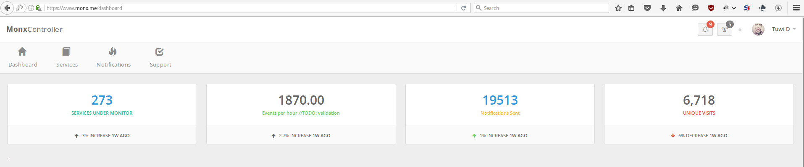
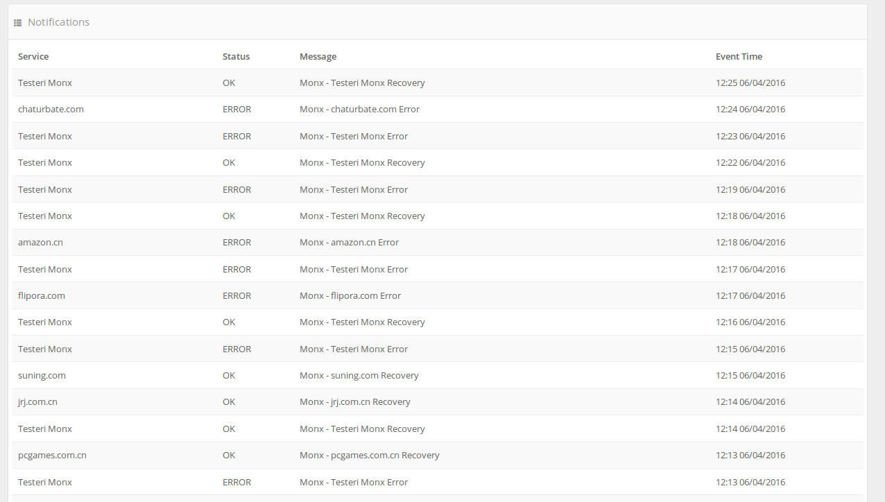
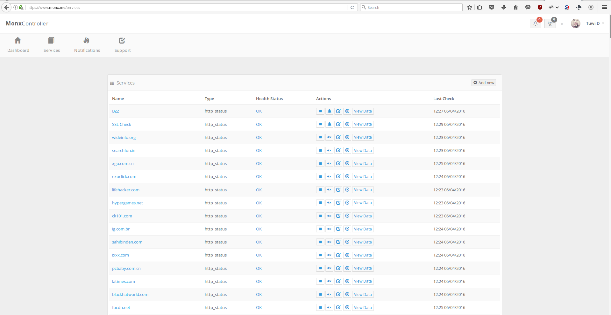
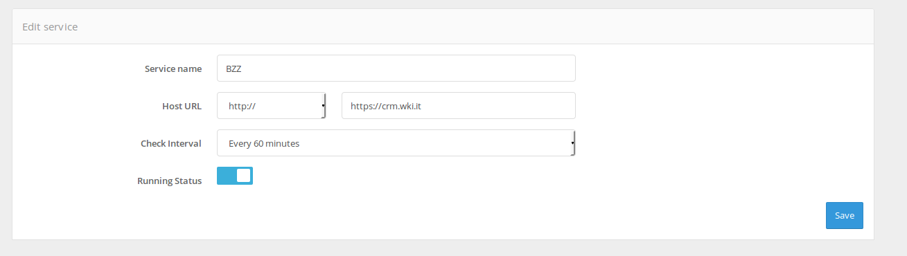

# Monx Monitoring System V3

## What is Monx?
- Monx is a monitoring system oriented on webservices and IoT devices. Currently its an ongoing project still being developed

## Monx in Action
- Intuitive dashboard 

- Notifications 

- List of services

- Easy to edit services

## Installtion 

Install nodejs ( from their installation script or by your own way )

    $ curl -sL https://deb.nodesource.com/setup_5.x | sudo -E bash -
    $ sudo apt-get install nodejs

Install pm2:

    $ npm install -g pm2

Install nodemon:

    $ sudo npm install -g nodemon

Install nginx

      $ wget http://nginx.org/keys/nginx_signing.key
      $ sudo apt-key add nginx_signing.key

  For Debian replace codename with Debian distribution codename, and append the following to the end of the `/etc/apt/sources.list` file:

      deb http://nginx.org/packages/debian/ codename nginx
      deb-src http://nginx.org/packages/debian/ codename nginx

  For Ubuntu replace codename with Ubuntu distribution codename, and append the following to the end of the `/etc/apt/sources.list` file:

      deb http://nginx.org/packages/ubuntu/ codename nginx
      deb-src http://nginx.org/packages/ubuntu/ codename nginx
  Then we update the repos and install as follows:

      $ apt-get update
      $ apt-get install nginx

Configure nginx:
      Generate a certificate with letsencrypt and crate the following file in `/etc/nginx/sites-available/monxSSL` 
      as follows:
            server {
                listen 443;

                    ssl    on;
                    ssl_certificate    /etc/ssl/ceftikata/monx.crt;
                    ssl_certificate_key    /etc/ssl/ceftikata/monx.key;

                server_name  www.monx.me;

                location / {
                    proxy_pass http://127.0.0.1:3000;
                    proxy_set_header        X-Real-IP       $remote_addr;
                    proxy_set_header        X-Forwarded-For $proxy_add_x_forwarded_for;
                    proxy_http_version 1.1;
                    proxy_set_header Upgrade $http_upgrade;
                    proxy_set_header Connection 'upgrade';
                    proxy_set_header Host $host;
                    proxy_cache_bypass $http_upgrade;
                }
            }
      $ sudo ln -s /etc/nginx/sites-available/monx /etc/nginx/sites-enabled/
      $ sudo service nginx restart

Install redis

      $ sudo apt-get install build-essential
      $ sudo apt-get install tcl8.5
      $ cd /usr/local/src
      $ sudo wget http://download.redis.io/releases/redis-stable.tar.gz
      $ sudo tar xzf redis-stable.tar.gz
      $ sudo cd redis-stable
      $ sudo make
      $ sudo make install
      $ sudo ./utils/install_server.sh
      $ sudo service redis_6379 restart

Install rabbitmq

    $ cd ~
    $ sudo echo "deb http://www.rabbitmq.com/debian/ testing main" >> /etc/apt/sources.list
    $ wget https://www.rabbitmq.com/rabbitmq-signing-key-public.asc
    $ sudo apt-key add rabbitmq-signing-key-public.asc
    $ sudo apt-get -y install rabbitmq-server

Install mongo 

Clone the repo 

    $ git clone git@github.com:aglipanci/monx.git

Install the npm libraries

    $ cd monx
    $ npm install

Alter the configs in the config dir according to the samples
